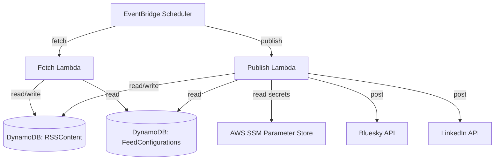

# Repository Information for Future Agents

This document provides architectural, deployment, and testing context for AI agents working on this repository.

## Overview & Architecture

This application fetches RSS feed articles and publishes them to **LinkedIn** and **Bluesky**. 



### Infrastructure (AWS CDK)
The CDK stack is defined in [stack.py](file:///home/herrsergio/my_publishfeed/publishfeed/cdk/stack.py) and provisions:
*   **DynamoDB Table `RSSContent`**: Stores articles parsed from RSS feeds (partition key: `url`, GSI: `StatusIndex` using `status` and `dateAdded`).
*   **DynamoDB Table `FeedConfigurations`**: Stores feed metadata (partition key: `feed_id`, attributes: `urls`, `hashtags`, `min_date`).
*   **SSM Parameters**:
    *   `/rss-feed/{feed_id}/bluesky_creds`: JSON string containing `handle` and `password`.
    *   `/rss-feed/global/linkedin_creds`: JSON string containing LinkedIn tokens.
    *   `/rss-feed/global/openai_key`: Secret string containing the OpenAI API Key (used by Mellea/LiteLLM for summaries).
*   **Lambda Functions** (`FetchFeedFunction` & `PublishFeedFunction`):
    *   Packaged using Docker container images based on the official `public.ecr.aws/lambda/python:3.11` base image.
    *   Scheduled via EventBridge (Fetch: daily, Publish: every 2 hours).

---

## Coding Guidelines & Implementation Details

### Bluesky Integration (`atproto`)
*   **Module**: Defined in [bluesky.py](file:///home/herrsergio/my_publishfeed/publishfeed/publishfeed/bluesky.py).
*   **SDK**: Uses the official `atproto` Python SDK.
*   **Rich Text & Clickable Links**: 
    AT Protocol requires UTF-8 byte offsets (facets) for links, mentions, and tags to render interactively in client apps. Do not format links as plain strings. Instead, use `atproto.client_utils.TextBuilder` to construct posts:
    ```python
    from atproto import client_utils
    tb = client_utils.TextBuilder()
    tb.text("Check out ")
    tb.link("this link", url)
    ```
*   **Clickable Hashtags (tag facets)**: A `#hashtag` added via `tb.text(...)` renders as plain, non-interactive text. To make it clickable it must be a `tag` facet (`tb.tag(display, value)`). The helper `append_text_with_hashtags(tb, text)` in [helpers.py](file:///home/herrsergio/my_publishfeed/publishfeed/publishfeed/helpers.py) scans a string for `#hashtags` and appends each as a tag facet while keeping the surrounding text plain. Use it instead of `tb.text()` when the text may contain hashtags (e.g. the OpenAI summary or the fuzzy-generated hashtags).
*   **Link Preview Card (external embed)**: Unlike Twitter/X, Bluesky does **not** crawl URLs to auto-generate a preview. The posting client must build an `app.bsky.embed.external` embed itself. `Bluesky.update_status(text, link_url=...)` in [bluesky.py](file:///home/herrsergio/my_publishfeed/publishfeed/publishfeed/bluesky.py) does this via `_build_external_embed`: it fetches the page's OpenGraph metadata (`opengraph_py3`), downloads the OG image, uploads it as a blob (`client.upload_blob`), and attaches it as the card thumbnail. Failures (no OG data, image >1MB which Bluesky rejects, upload errors) are caught and the post still goes out without the card.
*   **Character Limits**: Bluesky has a 300 Unicode grapheme character limit. The article URL is attached as the preview card (external embed), which does **not** count toward this limit, so the inline URL is intentionally omitted from the post body. Only the body text and any inline link/tag facet *display text* count. See `_calculate_max_post_body_length` in [helpers.py](file:///home/herrsergio/my_publishfeed/publishfeed/publishfeed/helpers.py).

### LinkedIn Integration (`rest/posts`)
*   **Module**: Posting logic in [ln_post.py](file:///home/herrsergio/my_publishfeed/publishfeed/publishfeed/ln_post.py); OAuth/header helpers in [ln_oauth.py](file:///home/herrsergio/my_publishfeed/publishfeed/publishfeed/ln_oauth.py).
*   **Versioned header**: LinkedIn's REST API requires a `LinkedIn-Version` header in `YYYYMM` format, and each version stays active only ~12 months. An expired version fails with `HTTP 426 NONEXISTENT_VERSION`. The value is centralized in `config.LINKEDIN_API_VERSION` ([config.py](file:///home/herrsergio/my_publishfeed/publishfeed/publishfeed/config.py), default `202605`) and overridable via the `LINKEDIN_API_VERSION` env var. **Bump it periodically.**
*   **Failure reporting**: `post_2_linkedin_new` returns `response.ok` so callers can distinguish success from failure; `helpers.py` logs accordingly rather than always claiming success.

### LLM Summarization with Mellea (`mellea` + `litellm`)
*   **Module**: Summarization in [llm_helpers.py](publishfeed/llm_helpers.py); validation in [validators.py](publishfeed/validators.py).
*   **Purpose**: Generate concise social media posts from article text using OpenAI (GPT-3.5-turbo via LiteLLM).
*   **Validation**: Uses Mellea's `Requirement` with `simple_validate()` to enforce third-person perspective. If first-person pronouns or phrases (e.g., "we", "our", "join us", "let's") are detected, Mellea automatically retries generation up to 3 times.
*   **Key function**: `summarize_text(text, max_tokens=100, max_retries=3)` in `llm_helpers.py`.
*   **Validator**: `no_first_person_pronouns(text)` in `validators.py` uses regex patterns with word boundaries to detect pronouns without false positives (e.g., "discuss" contains "us" but should pass).
*   **API Key**: Loaded via `load_openai_key()` from `openai_key.txt`, `OPENAI_KEY` env var, or SSM `/rss-feed/global/openai_key`. Set as `OPENAI_API_KEY` env var for LiteLLM.

### Legacy Code Notice
*   `models.py`, `tests.py`, and `main.py` contain legacy local SQLite code. The active system runs entirely on AWS DynamoDB + SSM. 
*   Do not try to run `tests.py` using sqlite/SQLAlchemy without explicit user request, as SQLAlchemy dependencies have been deprecated.

---

## Operations & Verification

### Local Virtual Environment
Always use the virtual environment located at `/home/herrsergio/my_publishfeed/publishfeed-venv/` when running python scripts locally.

### Config Syncing
When configuration changes in [feeds.yml](file:///home/herrsergio/my_publishfeed/publishfeed/publishfeed/feeds.yml), sync it to AWS DynamoDB and SSM using:
```bash
/home/herrsergio/my_publishfeed/publishfeed-venv/bin/python publishfeed/management/sync_feeds.py --region us-east-1 --table-name <configurations_table_name>
```

### Local Posting Test
Run the local Bluesky test script to verify credentials and posting functionality:
```bash
BLUESKY_HANDLE="your.handle" BLUESKY_PASSWORD="your-app-password" /home/herrsergio/my_publishfeed/publishfeed-venv/bin/python publishfeed/management/test_local_post.py
```
