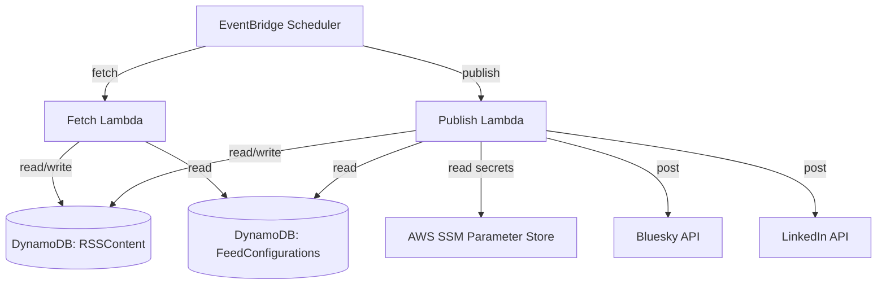

# Repository Information for Future Agents

This document provides architectural, deployment, and testing context for AI agents working on this repository.

## Overview & Architecture

This application fetches RSS feed articles and publishes them to **LinkedIn** and **Bluesky**. 



### Infrastructure (AWS CDK)
The CDK stack is defined in [stack.py](file:///home/herrsergio/my_publishfeed/publishfeed/cdk/stack.py) and provisions:
*   **DynamoDB Table `RSSContent`**: Stores articles parsed from RSS feeds (partition key: `url`, GSI: `StatusIndex` using `status` and `dateAdded`).
*   **DynamoDB Table `FeedConfigurations`**: Stores feed metadata (partition key: `feed_id`, attributes: `urls`, `hashtags`, `min_date`).
*   **SSM Parameters**:
    *   `/rss-feed/{feed_id}/bluesky_creds`: JSON string containing `handle` and `password`.
    *   `/rss-feed/global/linkedin_creds`: JSON string containing LinkedIn tokens.
    *   `/rss-feed/global/openai_key`: Secret string containing the OpenAI API Key.
*   **Lambda Functions** (`FetchFeedFunction` & `PublishFeedFunction`):
    *   Packaged using Docker container images based on the official `public.ecr.aws/lambda/python:3.11` base image.
    *   Scheduled via EventBridge (Fetch: daily, Publish: every 2 hours).

---

## Coding Guidelines & Implementation Details

### Bluesky Integration (`atproto`)
*   **Module**: Defined in [bluesky.py](file:///home/herrsergio/my_publishfeed/publishfeed/publishfeed/bluesky.py).
*   **SDK**: Uses the official `atproto` Python SDK.
*   **Rich Text & Clickable Links**: 
    AT Protocol requires UTF-8 byte offsets (facets) for links, mentions, and tags to render interactively in client apps. Do not format links as plain strings. Instead, use `atproto.client_utils.TextBuilder` to construct posts:
    ```python
    from atproto import client_utils
    tb = client_utils.TextBuilder()
    tb.text("Check out ")
    tb.link("this link", url)
    ```
*   **Character Limits**: Bluesky has a 300 Unicode grapheme character limit. Unlike Twitter, links count as their actual URL string length. Keep this in mind during text truncation calculations.

### Legacy Code Notice
*   `models.py`, `tests.py`, and `main.py` contain legacy local SQLite code. The active system runs entirely on AWS DynamoDB + SSM. 
*   Do not try to run `tests.py` using sqlite/SQLAlchemy without explicit user request, as SQLAlchemy dependencies have been deprecated.

---

## Operations & Verification

### Local Virtual Environment
Always use the virtual environment located at `/home/herrsergio/my_publishfeed/publishfeed-venv/` when running python scripts locally.

### Config Syncing
When configuration changes in [feeds.yml](file:///home/herrsergio/my_publishfeed/publishfeed/publishfeed/feeds.yml), sync it to AWS DynamoDB and SSM using:
```bash
/home/herrsergio/my_publishfeed/publishfeed-venv/bin/python publishfeed/management/sync_feeds.py --region us-east-1 --table-name <configurations_table_name>
```

### Local Posting Test
Run the local Bluesky test script to verify credentials and posting functionality:
```bash
BLUESKY_HANDLE="your.handle" BLUESKY_PASSWORD="your-app-password" /home/herrsergio/my_publishfeed/publishfeed-venv/bin/python publishfeed/management/test_local_post.py
```
